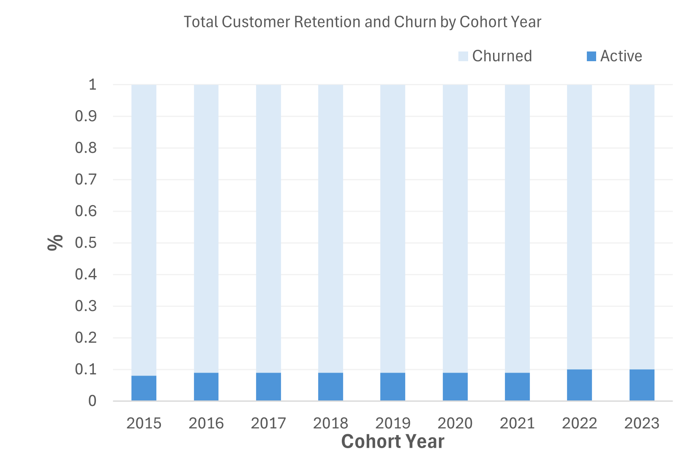

## Dataset Details
This business dataset entails  information about customers, products, sales transactions, territories, promotions, and financial metrics from **04-02-15** to **18-04-24**

## Project Overview
- I prepared the raw dataset through standard cleaning processes
- Created cohort views in SQL to allow focused analysis on customer behavior over time, ensuring that the original dataset remained untouched and intact. By using views, we were able to structure the data for specific cohort-based insights without altering or duplicating the source tables 
   > *[Script Here](cohort_analysis_view.sql)*
- Then  analyzed the resulting data focusing on sales, customer behavior, and product performance to identify trends and create insights from it. 
- The primary objective of this analysis was to explore:
   -  Customer Segmentation: Who are our most valuable customers?
   - Cohort Analysis: How do different customer groups generate revenue?
  - Retention Analysis: Which customers haven't purchased recently?
## 📝Insights

### 1.Key Cohort Insights:
🖥️ Query: 1-[CohortAnalysis.sql](CohortAnalysis.sql)

📈 Visualization:

- *Customer value over time is declining*:
  -  **Avg lifetime value per customer** has dropped from **$5.6K (2015)** to **$1.9K (2024)**. Retention is weakening: Lifetime/initial revenue ratio has shrunk over the years, indicating newer customers may be less loyal or lower-spending. **2022** and **2023** cohorts brought high initial revenues but relatively weaker retention. 
  -  **Older cohorts** **(2015–2017)** have ratios close to or above **2.0**, meaning customers generated twice their initial value over time. Newer cohorts **(2022–2024)** show a sharp drop, with ratios approaching **1.0**, indicating minimal post-purchase value
-  *Cohort Behavior Over Time:*
   - **Over Time Older cohorts** **(2015–2017)** generate consistent, long-term revenue — they contribute smaller but steady revenue even **7–10 years** after acquisition. Newer cohorts **(2020–2024)** are much more front-loaded — most revenue happens in the first **1–2 years **after the first purchase, with sharp fall-offs after. 
   - **Biggest Long-Term Contributors 2015** cohort still generated **$358K** in **2024** — impressive 10-year longevity. **2016–2017** cohorts also show strong multi-year contributions, each making hundreds of thousands even **7–8 years** later. **2018** and **2019** cohorts continue to bring significant yearly revenue **(over $700K each even in 2024)**.

- *High Per-Customer Potential*
  - **2015** **cohort** has the highest per-customer spending potential. **2018 cohort** generated the most repeat revenue in total, suggesting the largest retained customer base. 
  - **📈 Older cohorts** consistently show higher returns over time. **2015–2017** cohorts doubled their initial value, showing the strongest long-term value creation.
  
 -  *Drop-Off in Recent Cohorts*
     -   **2022 cohort revenue** dropped from **$23**.**25M** **(2022)** ➔ **$4.03M (2023)** ➔ **$1.14M (2024)**. **2023 cohort** dropped from **$13.37M (2023)** ➔ **$577K (2024)**. **2024** **cohort** is brand new but only contributed **$2.72M** so far. Newer cohorts are not sustaining revenue past **Year 1–2** — very sharp declines compared to earlier cohorts.
   - 💡*Business Recommendations:*

     - **Segment your customer** base more granularly based on their cohort and tailor marketing, sales, and retention strategies accordingly. For older cohorts **(2015–2017)**, focus on maximizing lifetime value through exclusive offers and rewards for loyalty. For newer cohorts **(2022–2024**), prioritize strategies to increase repeat purchases early in the customer journey to drive retention before the revenue drops off.
     - **Invest in customer loyalty programs** to encourage repeat purchases and long-term engagement. Offering incentives like discounts, exclusive offers, or early access to new products can help increase repeat purchases and improve customer retention
     - **Shift from purely transactional marketing tactics to more value-based acquisition**, where the emphasis is on finding customers who fit well with your brand’s long-term goals and are more likely to become loyal.
### 🚀Takeaway:
> - **older cohorts (2015–2019)** represent a more valuable and loyal customer base, while newer cohorts **(2020–2024)** show weaker retention, with customers primarily generating front-loaded revenue and then disappearing quickly   

### 2.Churned Customers Insights:
🖥️ Query: 2-[Churned Customers.sql](<churned customers.sql>)

📈 Visualization:

-  📊 *Key Insights:*:
    
    
   - Most years have **90%+ churned** customers.Only about **8% to 10%** are active in each cohort.Older cohorts have slightly worse retention ,(2015 churn = 92%, 2022 churn = 90%) ,2023 cohort has **same churn pattern** 

   - **Churn stabilization** occurs around **90%** after 2-3 years, suggesting a predictable pattern in long-term retention.
   - **Retention rates** remain consistently low (8-10%) across all cohorts, pointing to **systemic retention challenges** rather than issues specific to certain years.
 - 💡*Business Recommendations:*

   - **Enhance early engagement** by focusing on the first 1-2 years, offering **onboarding incentives**, **loyalty rewards**, and **personalized offers** to boost long-term retention.
   - **Re-engage high-value churned customers** through **targeted win-back campaigns**, as focusing on valuable users can provide a **higher ROI** than general retention efforts.
   - **Proactively manage churn risk** by identifying **warning signs** and taking early intervention steps to prevent **at-risk customers** from lapsing.

### 🚀 Takeaway:

> - **Newer cohorts (2022-2023)** follow a similar churn trajectory, indicating that without corrective action, future cohorts are likely to experience the same pattern.

### 3.Churned Customers Insights:
🖥️ Query:3-[RFM.sql](<done customer_segmentation.sql>)

📈 Visualization:

-  📊 *Key Insights:*:
    
    
 
- **Potential Loyalists**  
  - These customers are **very active recently** and **moderately frequent buyers**.
  - Big group: **21,739 customers**  
  - They have spent a total of **~134 million**.
  - On average, each Potential Loyalist spends **~6,185**.

- **Lost**  
  - Customers who **haven't purchased recently** (high recency score, low frequency/monetary scores).
  - Even though they are the **biggest group** (27,553 customers), their **average revenue is low** (around 2,489 each).
  - **Meaning**: These are customers who used to buy but have **churned** or **are inactive** now.

- **Champions**  
  - The **best customers**.
  - Smallest group (only **195 customers**) — but they are the **highest spenders**!
  - Each Champion customer spends an **average of ~16,431**.
  - These are **your VIPs**, the ones you absolutely must **retain**.

- ### 💡 Business Recommendations:

| Segment             | Action Recommendation                           |
|:--------------------|:-------------------------------------------------|
| Potential Loyalists | Focus on loyalty programs to **make them Champions** (give them offers, early access, personalized marketing). |
| Lost                | Try **reactivation campaigns** (discounts, surveys, win-back emails) OR **accept churn** and focus efforts elsewhere if the cost is too high. |
| Champions           | **Prioritize retention** — give them premium services, VIP offers, exclusive events. Losing them would cost **a lot**! |

### 🚀 Takeaway:

>  **Important:**
> - Always protect the top (Champions).
>- Nurture the middle (Potential Loyalists).
>- Don't waste too much money on the bottom (Lost) unless special cases.

## 🛠️Technical Details
- Analysis Tools: MySQL
- Visualization: ChatGPT,Excel